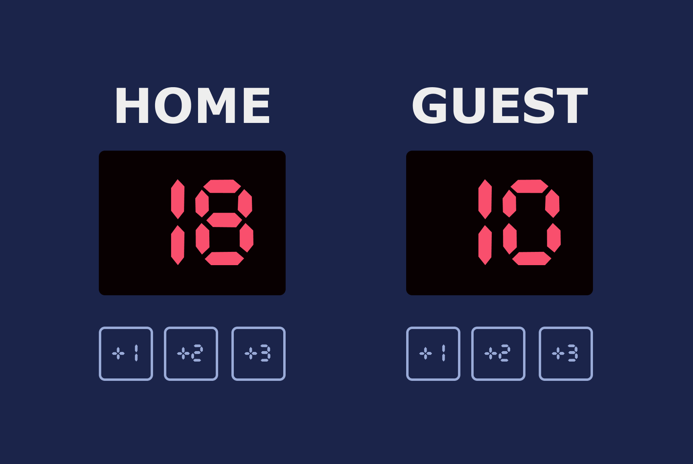

# Basketball Scoreboard


A simple basketball scoreboard application built with TypeScript, HTML, and CSS. This project allows users to track scores for two teams (Home and Guest) and reset the scores when needed.

## Table of Contents

1. [Features](#features)
2. [Screenshots](#screenshots)
3. [Installation](#installation)
4. [Usage](#usage)
5. [Project Structure](#project-structure)
6. [Development](#development)
7. [Technologies Used](#technologies-used)
8. [License](#license)

## Features

- Add points to the Home or Guest team with +1, +2, or +3 buttons
- Reset scores for both teams with a single button
- Responsive and visually appealing design
- Built with modern web technologies: TypeScript, Vite, and CSS

## Screenshots

### Main Interface


## Demo
View the live demo [here](https:/basketball-scoreboard.kevinngongang.dev/).

## Installation

To set up the project locally, follow these steps:

1. Clone the repository:
   ```bash
   git clone https://github.com/bakadja/basketball-scoreboard.git
   cd basketball-scoreboard
   ```

2. Install dependencies:
   ```bash
   npm install
   ```

3. Start the development server:
   ```bash
   npm run dev
   ```

4. Open the application in your browser at `http://localhost:5173`

## Usage

### Adding Points
- Click the `+1`, `+2`, or `+3` buttons under the "HOME" or "GUEST" sections to add points to the respective team.

### Resetting Scores
- Click the "Reset" button to reset both teams' scores to `0`.

## Project Structure

```
basketball/
├── index.html          # Main HTML structure
├── package.json        # npm configuration and dependencies
├── tsconfig.json       # TypeScript configuration
├── Readme.md           # Documentation (this file)
├── public/             # Static assets
└── src/
    ├── main.ts         # JavaScript/TypeScript logic
    ├── style.css       # CSS styles
    └── vite-env.d.ts   # Vite environment declarations
```

## Development

### Available Scripts

- **Start development server**: `npm run dev`
- **Build for production**: `npm run build`
- **Preview production build**: `npm run preview`

### Core Functionality

The scoreboard is built around two main functions:

```typescript
// Update a team's score
function updateScore(team: string, score: number) {
  // ...
}

// Reset all scores
function resetScore() {
  // ...
}
```

## Technologies Used

- **TypeScript**: For typed and more robust JavaScript development
- **Vite**: For fast development and optimized builds
- **HTML/CSS**: For structure and styling of the application
- **Google Fonts**: Roboto and Cursed Timer ULiL for the user interface

## License

This project is licensed under the MIT License. See the [LICENSE](LICENSE) file for details.